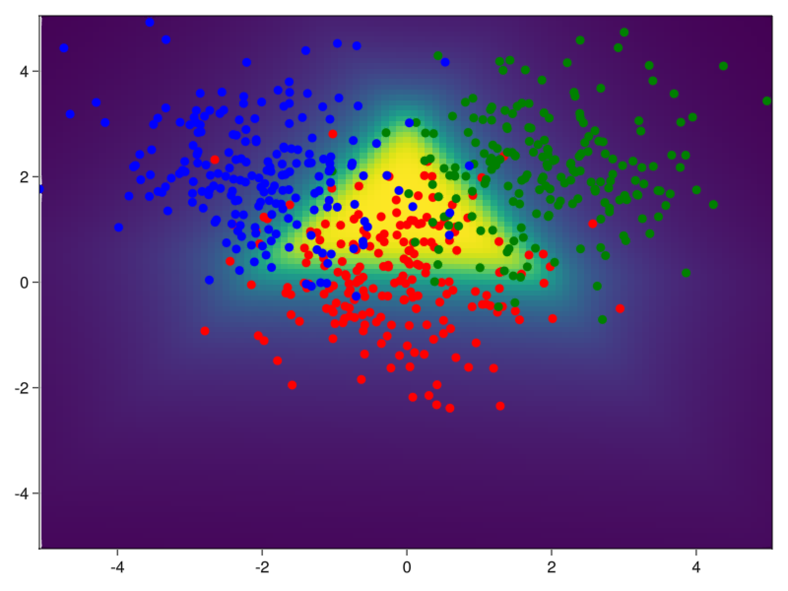

# EvidentialFlux

This is a Julia implementation in Flux of the Evidential Deep Learning framework. It strives to estimate heteroskedastic aleatoric uncertainty as well as epistemic uncertainty along with every prediction made. All of it calculated in one glorious forward pass. Boom!

## Classification

Deep evidential modeling works for classification as well as for regression. In
the plot below you can see the epistemic uncertainty as a consequence of
position in the plot. The task is to separate three Gaussians in 2D. The code
for this example can be found in
[classification.jl](examples/classification.jl).

## Summary

Uncertainty is crucial for the deployment and utilization of robust machine
learning in production. No model is perfect and each and every one of them have
their own strengths and weaknesses, but as a minimum requirement we should all
at least demand that our models report uncertainty in every prediction.
