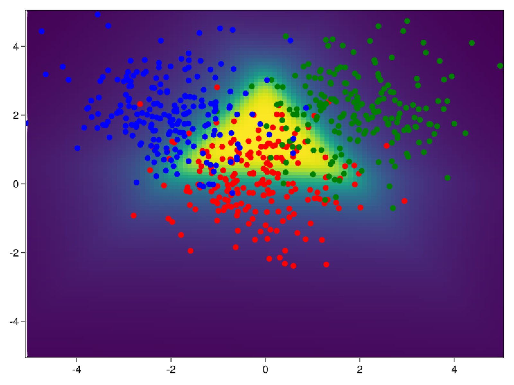
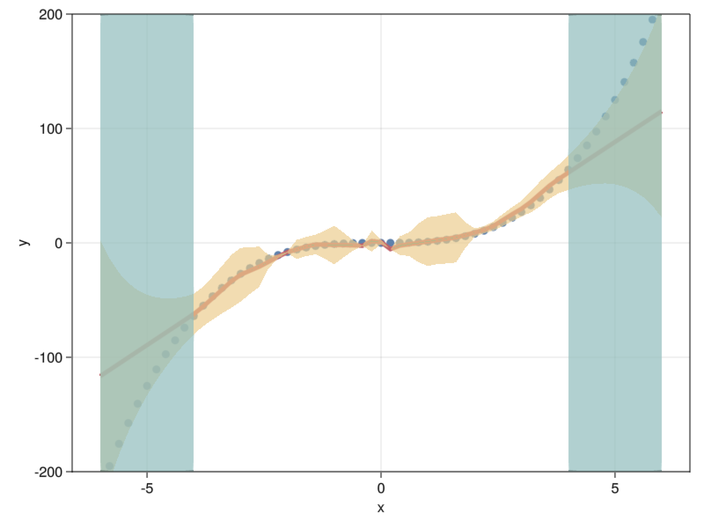

# EvidentialFlux

[](https://github.com/DoktorMike/EvidentialFlux.jl/actions/workflows/documentation.yml)
[](https://doktormike.github.io/EvidentialFlux.jl/stable)
[](https://doktormike.github.io/EvidentialFlux.jl/dev)
[](https://github.com/fredrikekre/Runic.jl)
[](https://zenodo.org/badge/latestdoi/487830887)

A Julia/Flux implementation of the Evidential Deep Learning framework. Estimate
heteroskedastic aleatoric and epistemic uncertainty in a single forward pass.

## Installing

```julia
using Pkg; Pkg.add(url="https://github.com/DoktorMike/EvidentialFlux.jl")
```

## Features

EvidentialFlux provides evidential output layers for regression, classification,
and count data. All layers are subtypes of `AbstractEvidentialLayer`, which
provides generic `predict` and `split_params` dispatch.

| Layer | Use case | Output | Uncertainty |
|-------|----------|--------|-------------|
| `NIG(in => out)` | Regression | γ, ν, α, β (4 × out) | Aleatoric + epistemic |
| `PG(in => out)` | Count regression | α, β (2 × out) | Aleatoric + epistemic |
| `BNB(in => out)` | Overdispersed count regression | r, α, β (3 × out) | Aleatoric + epistemic |
| `DIR(in => out)` | Classification | Dirichlet concentrations (out) | Epistemic |
| `FDIR(in => out)` | Classification | α, p, τ (2 × out + 1) | Aleatoric + epistemic |
| `MVE(in => out)` | Regression | μ, σ (2 × out) | Aleatoric |

### Loss functions

| Function | Description |
|----------|-------------|
| `nigloss(y, γ, ν, α, β, λ, ϵ)` | Standard evidential regression loss (Amini et al. 2020) |
| `nigloss2(y, γ, ν, α, β, λ, p)` | Corrected DER loss (Meinert et al. 2022) |
| `nigloss3(y, γ, ν, α, β, λ, λ₁)` | Uncertainty regularized loss (Ye et al. 2024) |
| `dirloss(y, α, t)` | Dirichlet classification loss with KL regularization, returns `(1, B)` |
| `dirloss2(y, α, t)` | Dirichlet loss + correct evidence regularization (Pandey et al. 2025) |
| `dirmultloss(y, α)` | Dirichlet-Multinomial NLL for count vector targets (reuses `DIR` layer) |
| `fdirloss(y, α, p, τ)` | Flexible Dirichlet loss (Yoon & Kim 2025) |
| `pgloss(y, α, β, λ)` | Poisson-Gamma count regression loss (NLL + regularizer) |
| `bnbloss(y, r, α, β, λ)` | Beta-Negative Binomial count regression loss (NLL + regularizer) |
| `nllpg(y, α, β)` | Negative Binomial marginal NLL |
| `nllbnb(y, r, α, β)` | Beta-Negative Binomial marginal NLL |
| `mveloss(y, μ, σ)` | Gaussian negative log-likelihood |
| `nllstudent(y, γ, ν, α, β)` | Student-T negative log-likelihood |

### Utilities

| Function | Description |
|----------|-------------|
| `predict(model, x)` | Unified prediction dispatch; returns a NamedTuple for NIG/MVE, raw array for DIR |
| `split_params(LayerType, y)` | Generic output decomposition into a NamedTuple (e.g. `split_params(NIG, y)`) |
| `splitnig(y)` | Split concatenated NIG output into (γ, ν, α, β) |
| `splitmve(y)` | Split concatenated MVE output into (μ, σ) |
| `splitpg(y)` | Split concatenated PG output into (α, β) |
| `splitbnb(y)` | Split concatenated BNB output into (r, α, β) |
| `splitfdir(y)` | Split concatenated FDIR output into (α, p, τ) |
| `evidence(ν, α)` | NIG total evidence: 2ν + α |
| `evidence(α)` | DIR evidence: α - 1 |

`predict` returns NamedTuples for NIG, PG, BNB, MVE, and FDIR, so you can
access parameters by name or destructure them:

```julia
p = predict(model, x)
p.γ   # access by name
γ, ν, α, β = predict(model, x)  # destructuring still works
```

### Uncertainty

All layers support a unified type-dispatched API for uncertainty
decomposition. Pass the **layer type** as the first argument:

```julia
eu = epistemic(NIG, ν, α, β)
au = aleatoric(NIG, ν, α, β)
```

| Layer | `epistemic(Type, ...)` | `aleatoric(Type, ...)` |
|-------|----------------------|----------------------|
| `NIG` | `epistemic(NIG, ν, α, β)` = 1/√ν | `aleatoric(NIG, ν, α, β)` = β(1+ν)/(να) |
| `DIR` | `epistemic(DIR, α)` = K/Σα | — |
| `MVE` | — | `aleatoric(MVE, σ)` = σ |
| `PG` | `epistemic(PG, α, β)` = α/β² | `aleatoric(PG, α, β)` = α/β |
| `BNB` | `epistemic(BNB, r, α, β)` = r²α(α+β-1)/((β-1)²(β-2)) | `aleatoric(BNB, r, α, β)` = rα(α+β-1)/((β-1)(β-2)) |
| `FDIR` | `epistemic(FDIR, α, p, τ)` | `aleatoric(FDIR, α, p, τ)` = TU - EU |

For NIG, the legacy arity-dispatched functions (`uncertainty(ν, α, β)`,
`uncertainty(α, β)`, `epistemic(ν)`, `aleatoric(ν, α, β)`) remain available
for backward compatibility.

**Notes:**
- **DIR** and **MVE** only expose one uncertainty type (epistemic and aleatoric, respectively)
- **BNB** requires β > 2 for the moments to exist; values are clamped internally
- **FDIR** uncertainties are per-sample `(1, B)`, derived from the FD mixture-of-Dirichlets decomposition (Yoon & Kim 2025)
- **PG** and **BNB** uncertainties are per-output `(O, B)`, derived via the law of total variance

## Quick start

### Evidential regression (NIG)

```julia
using Flux, EvidentialFlux, Statistics

x = Float32.(-4:0.1:4)
y = x .^ 3 .+ randn(Float32, length(x)) .* 3

model = Chain(Dense(1 => 100, relu), Dense(100 => 100, relu), NIG(100 => 1))
opt_state = Flux.setup(AdamW(1e-3), model)

for epoch in 1:3000
    loss, grads = Flux.withgradient(model) do m
        γ, ν, α, β = splitnig(m(x'))
        mean(nigloss(y, γ, ν, α, β, 0.001))
    end
    Flux.update!(opt_state, model, grads[1])
end

# Extract predictions and uncertainty
γ, ν, α, β = predict(model, x')
eu = epistemic(ν)
au = aleatoric(ν, α, β)
```

### Mean-variance estimation (MVE)

```julia
model = Chain(Dense(1 => 100, relu), Dense(100 => 100, relu), MVE(100 => 1))
opt_state = Flux.setup(AdamW(1e-3), model)

for epoch in 1:3000
    loss, grads = Flux.withgradient(model) do m
        μ, σ = predict(m, x')
        mean(mveloss(y, μ, σ))
    end
    Flux.update!(opt_state, model, grads[1])
end
```

## Classification

Deep evidential modeling works for classification as well. The plot below shows
epistemic uncertainty when separating three Gaussians in 2D. See
[classification.jl](examples/classification.jl).



## Regression

For regression, the NormalInverseGamma distribution models a type II likelihood
that explicitly captures aleatoric and epistemic uncertainty. See
[regression.jl](examples/regression.jl).



## Examples

The [examples/](examples/) folder contains complete working examples:

- [regression.jl](examples/regression.jl) -- NIG with `nigloss`
- [regression2.jl](examples/regression2.jl) -- NIG with `nigloss2` (corrected DER)
- [regression3.jl](examples/regression3.jl) -- NIG with LayerNorm and evidence tracking
- [regression4.jl](examples/regression4.jl) -- MVE with parameter freezing/thawing
- [classification.jl](examples/classification.jl) -- DIR for multi-class classification

## GPU support

All layers and losses work on both CPU and GPU via standard Flux conventions.
Move a model and data to the GPU with `gpu`:

```julia
using CUDA

model = Chain(Dense(1 => 100, relu), NIG(100 => 1)) |> gpu
x_gpu = cu(x)
γ, ν, α, β = predict(model, x_gpu)  # returns CuArrays
```

Gradient computation, `predict`, `split_params`, and all loss functions are
GPU-compatible. The test suite includes GPU-specific tests that run
automatically when `CUDA.functional()` is true.

## Adding a new distributional output

All output layers subtype `AbstractEvidentialLayer`. To add a new distribution
(e.g. LogNormal), implement four things:

**1. Layer struct and forward pass** (`src/dense.jl`):

```julia
struct MyLayer{F, M <: AbstractMatrix, B} <: AbstractEvidentialLayer
    W::M; b::B; σ::F
end

function (a::MyLayer)(x::AbstractVecOrMat)
    o = a.W * x .+ a.b
    chunk1, chunk2 = _split_equal(o, 2)       # reuse generic splitter
    return vcat(chunk1, a.σ.(chunk2))
end
```

**2. Parameter decomposition** (`src/utils.jl`):

```julia
split_params(::Type{<:MyLayer}, y) = let (a, b) = _split_equal(y, 2)
    (a = a, b = b)
end
```

`predict` then works automatically -- no additional dispatch needed.

**3. Loss function(s)** (`src/losses.jl`):

Define loss functions that operate on the split parameters.

**4. Uncertainty/evidence methods** (`src/utils.jl`, optional):

Add `uncertainty` and/or `evidence` methods via multiple dispatch if your
distribution supports them.

## References

- Amini, A., Schwarting, W., Soleimany, A. & Rus, D. Deep Evidential Regression. NeurIPS (2020).
- Meinert, N., Gawlikowski, J. & Lavin, A. The Unreasonable Effectiveness of Deep Evidential Regression. arXiv (2022).
- Ye, K., Chen, T., Wei, H. & Zhan, L. Uncertainty Regularized Evidential Regression. AAAI 38 (2024).
- Sensoy, M., Kaplan, L. & Kandemir, M. Evidential Deep Learning to Quantify Classification Uncertainty. NeurIPS (2018).
- Pandey, D. S., Choi, H. & Yu, Q. Generalized Regularized Evidential Deep Learning Models. arXiv (2025).
- Yoon, T. & Kim, H. Uncertainty Estimation by Flexible Evidential Deep Learning. arXiv (2025).

## Summary

Uncertainty is crucial for the deployment and utilization of robust machine
learning in production. No model is perfect and each one of them has
strengths and weaknesses, but as a minimum requirement, we should all
at least demand that our models report uncertainty in every prediction.
